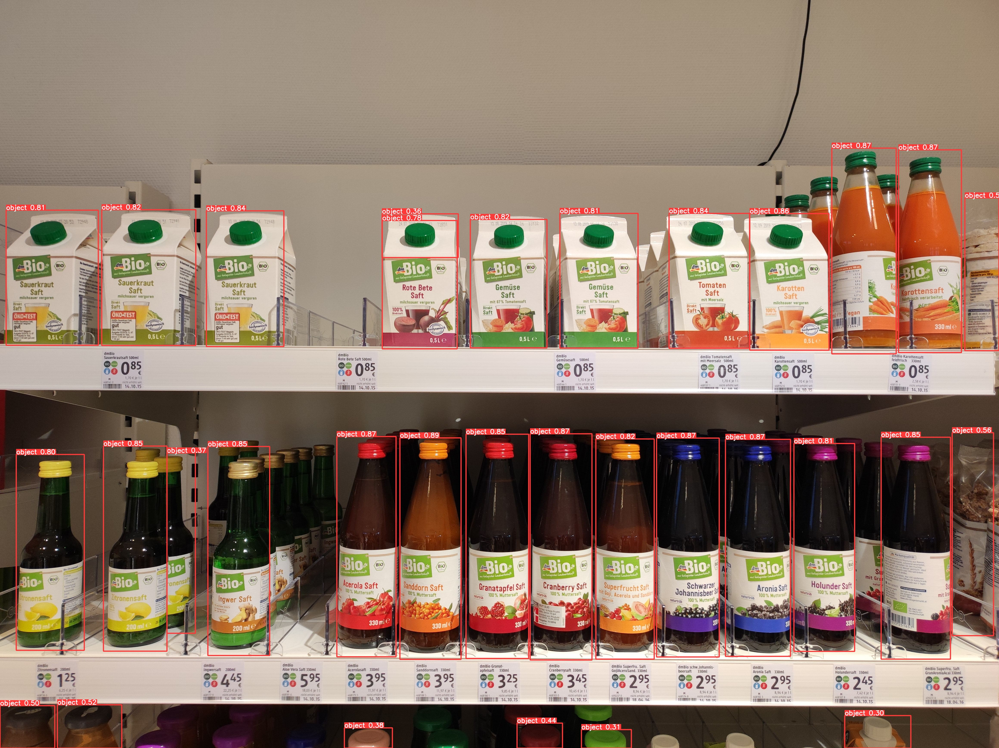

# Installation
Für das Training verwende ich den SKU110k Datensatz, dieser kann unter folgender Addresse heruntergeladen werden: https://retailvisionworkshop.github.io/detection_challenge_2020/. Die Dateien müssen in einen Ornder `input/` auf der obersten Projektebene abgelegt werden, danach kann mithilfe des Befehls `python src/prepare` der Datensatz für das Training mit Yolov5 vorbereitet werden.

# Fehlermeldung
Beim ersten Ausführen von `python src/training` wird eine Fehlermeldung ausgeworfen, welche besagt das der Datensatz nicht gefunden werden kann. Um die Fehlermeldung zu beheben muss eine Abschnitt im Quellcode den Yolov5-pip Pakets entfernt werden. Der folgende Abschnitt muss entfernt werden: https://github.com/fcakyon/yolov5-pip/pull/151/files.

# Annotationsformat
Beschreibung für das Annotationsformat: https://roboflow.com/formats/yolov5-pytorch-txt.

# Beispiel
Nach einem Training von 10 Epochen liefert das Modell bereit ein zeigbares Ergebnis. Die Bounding Boxen sind noch merkwürdig skaliert und sollen eigentlich das gesamte Produkt umfassen. Im `/docs` Ordner sind weiter gut funktionierende Besipiele.
### input

### input + detections
